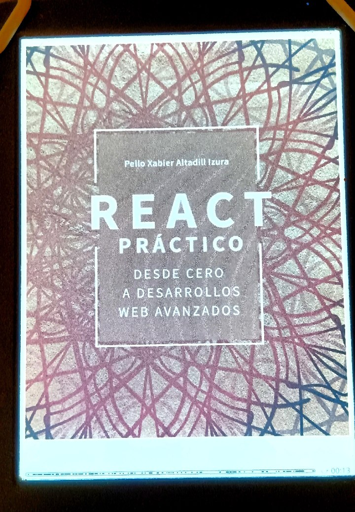

# Repository for "React práctico" exercises.

This repository contains all the materials and examples used in the book **"React práctico"** .

****

## Repository Content

This repository includes:

- Code examples from the book.
- Supplementary materials used in the book.
- Exercises.

**** 

## How to Use

1. Clone or download this repository.
2. Navigate through the folders to find the relevant examples or materials.
3. Refer to the book for detailed explanations and context.

---

## Book Details

- **Title**: [React práctico](https://anayamultimedia.es/libro/titulos-especiales/react-practico-pello-xabier-altadill-izura-9788441547735/)
- **Author**: Pello Xabier Altadill Izura  
- **Publisher:** Anaya Multimedia
- **ISBN**: 978-84-415-4773-5  
- **Publication Date**: April 20, 2023  
- **Format**: Paperback, ePUB

---

## About the Book

Born within Facebook but made available to the world, React is being used by major companies such as Airbnb, Apple, Dropbox, Instagram, Netflix, Twitter, Tesla, and Uber. This book provides practical insights and examples to master React.

---

---

#### Disclaimer & License

All rights to the book **"React práctico"** and its content are reserved and belong exclusively to its author.

This repository is intended solely for **educational purposes** and to support readers of the book. The materials and examples provided here are publicly available on the [Editor's website](https://recursos.grupoanaya.es/catalogos/complementos/MU00572401_9999961779.rar).

Please note that this repository is **not affiliated with or endorsed by the author or publisher**. It has been created independently to facilitate learning and understanding of the concepts presented in the book.

### Support the Author & Education

To support the author, the dissemination of knowledge, and the importance of education, I encourage you to:

- **Purchase the book** to access the full content and support the author's work.

- **Borrow the book** from your local or public library, from a friend, ...

- **Study hard and diligently** to get applied the knowledge.

---

